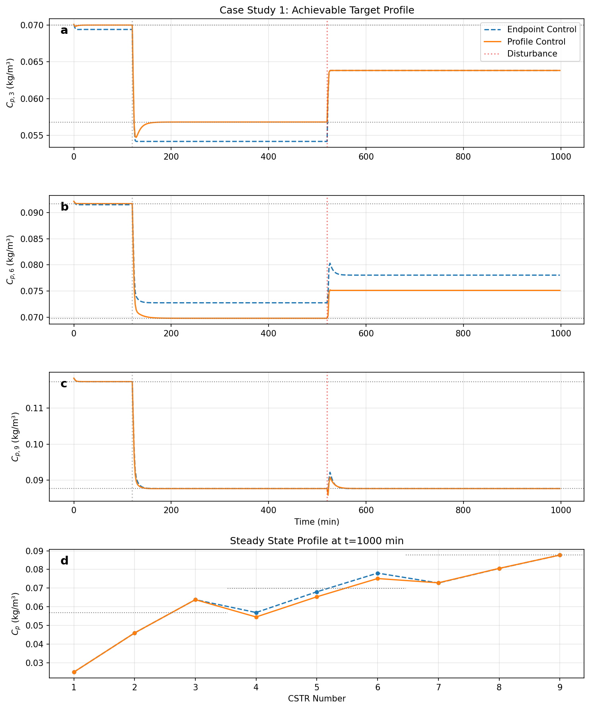
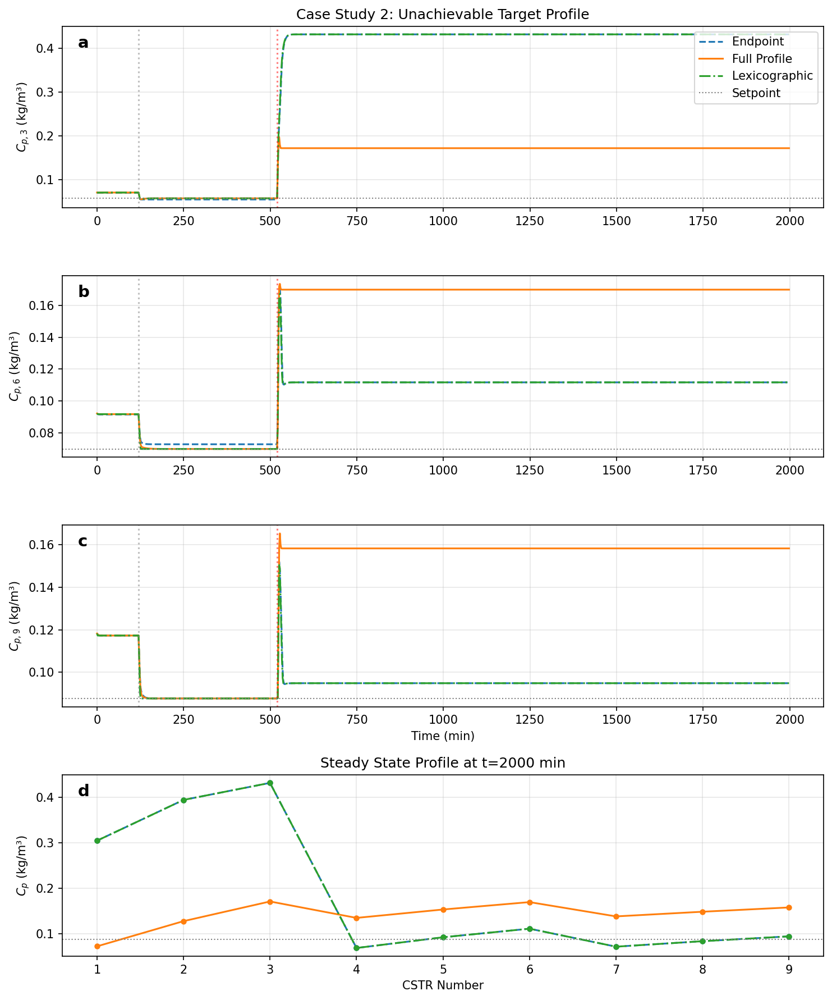
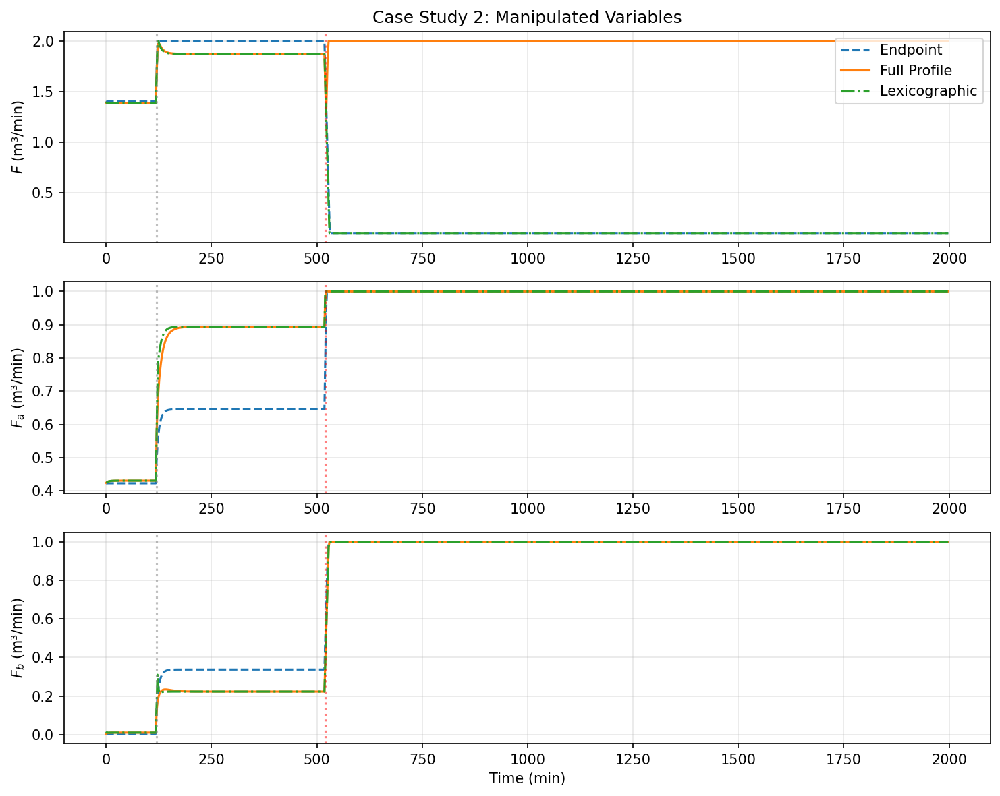

# Lexicographic Model Predictive Control for Profile Control

This repository implements lexicographic MPC for controlling distributed parameter systems, based on:

> Padhiyar & Bhartiya (2009). "Profile control in distributed parameter systems using lexicographic optimization based MPC", *Journal of Process Control* 19, 100-109.

## Problem Setup

### The Plug Flow Reactor

The system under control is a plug flow reactor (PFR), a continuous-flow tubular reactor used in chemical manufacturing. A liquid stream enters one end of a cylindrical vessel and exits the other. As fluid travels through the reactor, a dimerization reaction occurs:

$$2A \rightarrow P$$

Two molecules of reactant $A$ combine to form one molecule of product $P$. The longer the fluid remains inside (the residence time), the more conversion occurs. PFRs are used industrially to produce polymers, pharmaceuticals, and specialty chemicals.

### Spatial Discretization

A PFR is an infinite-dimensional system: concentration varies continuously along the reactor length. For computational tractability, we approximate it as 9 continuously stirred tank reactors (CSTRs) in series. Each CSTR is a well-mixed tank where fluid enters from the previous tank, mixes instantaneously, reacts, and exits to the next tank. As the number of CSTRs increases, this approximation converges to true plug flow. With 9 tanks, the state dimension is 18 (two concentrations per tank).

```
           Main Feed                Trim Feed 1           Trim Feed 2
           (flow F)                 (flow Fₐ)             (flow Fᵦ)
              ↓                         ↓                     ↓
    ┌─────────┼─────────────────────────┼─────────────────────┼─────────┐
    │         ▼                         ▼                     ▼         │
    │  ┌───┐ ┌───┐ ┌───┐ ┌───┐ ┌───┐ ┌───┐ ┌───┐ ┌───┐ ┌───┐           │
    │  │ 1 │→│ 2 │→│ 3 │→│ 4 │→│ 5 │→│ 6 │→│ 7 │→│ 8 │→│ 9 │→ outlet  │
    │  └───┘ └───┘ └───┘ └───┘ └───┘ └───┘ └───┘ └───┘ └───┘           │
    │              ↑           ↑           ↑                           │
    │           measure     measure     measure                        │
    │             y₁          y₂          y₃                           │
    └──────────────────────────────────────────────────────────────────┘
```

The reaction rate is proportional to $C_A^2$ (second-order kinetics), which makes the system nonlinear.

### Control Difficulty

Several features make this system difficult to control.

First, inputs and outputs are spatially distributed. Three flow rates ($F$, $F_a$, $F_b$) inject material at different locations along the reactor. Three outputs ($y_1$, $y_2$, $y_3$) are measured at tanks 3, 6, and 9. The main feed $F$ affects all 9 tanks, the trim feed $F_a$ affects only tanks 4 through 9, and $F_b$ affects only tanks 7 through 9. This asymmetric structure differs from lumped-parameter systems where all inputs affect all outputs.

Second, the outputs are coupled through convective transport. Material flows unidirectionally from upstream to downstream. Any change at tank $i$ propagates to all subsequent tanks. Adjusting $F$ to improve $y_1$ will also affect $y_2$ and $y_3$. The outputs cannot be decoupled because they share the same material stream.

Third, the reaction kinetics are nonlinear. The rate scales with $C_A^2$, so doubling the concentration quadruples the reaction rate. Linear MPC approximations are valid only locally and must be updated at each time step.

Fourth, input constraints can make the target infeasible. Flow rates are bounded: $F \in [0.1, 2.0]$, $F_a \in [0, 1]$, $F_b \in [0, 1]$. Rate limits restrict changes to $|\Delta F| \leq 0.3$ per time step. Under large disturbances, the set of achievable outputs may not contain the target profile. The controller must then decide which outputs to sacrifice.

### State and Input Variables

Each CSTR $i \in \{1, \ldots, 9\}$ has two concentration states: $C_{A,i}(t)$ for the reactant and $C_{P,i}(t)$ for the product, both in kg/m³. The total state dimension is $n = 18$.

The three manipulated inputs are volumetric flow rates in m³/min:
- $F \in [0.1, 2.0]$: main feed entering tank 1
- $F_a \in [0, 1.0]$: trim feed entering tank 4
- $F_b \in [0, 1.0]$: trim feed entering tank 7

The controlled outputs are product concentrations at three axial positions:

$$\mathbf{y} = \begin{bmatrix} C_{P,3} \\ C_{P,6} \\ C_{P,9} \end{bmatrix}$$

In practice, $C_{P,9}$ (the exit concentration) is most important because it determines what downstream processes receive. Off-spec product may need to be discarded or reprocessed.

### Dynamics

Each CSTR follows mass balance equations. For tank $i$:

$$\frac{dC_{A,i}}{dt} = \frac{F_{\text{in},i}}{V}(C_{A,i-1} - C_{A,i}) - 2k C_{A,i}^2$$

$$\frac{dC_{P,i}}{dt} = \frac{F_{\text{in},i}}{V}(C_{P,i-1} - C_{P,i}) + k C_{A,i}^2$$

Here $F_{\text{in},i}$ is the total volumetric flow into tank $i$, $V = 1$ m³ is the tank volume, and $k = 0.2$ m³/(kg·min) is the rate constant. The factor of 2 in reactant consumption reflects stoichiometry: two moles of $A$ are consumed per mole of $P$ produced.

Higher flow rates reduce the residence time $\tau = V/F$, giving less time for reaction and lower conversion. Lower flow rates increase residence time and conversion. When a disturbance increases the inlet concentration $C_A$, increasing the flow rate can flush out excess reactant before it over-converts.

## Control Objective

Given a target profile $\mathbf{r} = [r_1, r_2, r_3]^\top$, find inputs $\mathbf{u} = [F, F_a, F_b]^\top$ that track this profile.

### Infeasibility Under Disturbances

In normal operation, all three targets can be achieved. When a large disturbance occurs (e.g., the inlet concentration doubles), more product is generated throughout the reactor. To reduce product at the endpoint $y_3$, the flow rate must increase, reducing residence time. But higher flow also increases product upstream because more material passes through. With bounded inputs, it becomes impossible to achieve all targets simultaneously.

The achievable output combinations form a constrained set. Under large disturbances, the target profile lies outside this set. When the target is infeasible, the controller must choose which outputs to sacrifice. In many applications the endpoint $y_3$ is most important, so we first minimize the tracking error for $y_3$, then for $y_2$, then for $y_1$. This is lexicographic optimization.

## Control Strategies

### Endpoint Control

Endpoint control optimizes only the final output $y_3$:

$$\min_{\Delta \mathbf{u}} \sum_{k=1}^{p} w_3 (y_3(k) - r_3)^2 + \|\Delta \mathbf{u}\|^2_W$$

This achieves the best $y_3$ tracking but ignores $y_1$ and $y_2$.

### Full Profile Control

Full profile control optimizes all outputs with comparable weights:

$$\min_{\Delta \mathbf{u}} \sum_{k=1}^{p} \sum_{i=1}^{3} w_i (y_i(k) - r_i)^2 + \|\Delta \mathbf{u}\|^2_W$$

When the target is infeasible, this compromises on all outputs. None may reach their targets.

### Lexicographic MPC

Lexicographic MPC enforces a strict priority ordering $y_3 \succ y_2 \succ y_1$ through hierarchical weights:

$$\min_{\Delta \mathbf{u}} \sum_{k=1}^{p} \left[ w_1 (y_1(k) - r_1)^2 + 10^3 w_2 (y_2(k) - r_2)^2 + 10^6 w_3 (y_3(k) - r_3)^2 \right] + \|\Delta \mathbf{u}\|^2_W$$

This achieves the best possible $y_3$, then optimizes $y_2$ without degrading $y_3$, then $y_1$.

## MPC Formulation

The implementation uses Extended MPC (Garcia, 1984). At each time step:

1. Simulate the nonlinear model with constant input $\mathbf{u}_0$ to obtain the free response $\mathbf{Y}_{\text{free}}$
2. Linearize around the current state to obtain the step response matrix $\mathbf{S}$
3. Predict outputs as $\mathbf{Y} = \mathbf{Y}_{\text{free}} + \mathbf{S} \Delta\mathbf{U}$
4. Solve a QP to find optimal input moves $\Delta\mathbf{U}^*$

The QP subproblem is:

$$\min_{\Delta\mathbf{U}} \frac{1}{2} \Delta\mathbf{U}^\top \mathbf{H} \Delta\mathbf{U} + \mathbf{g}^\top \Delta\mathbf{U}$$

subject to move bounds $\Delta\mathbf{u}_{\min} \leq \Delta\mathbf{u}_k \leq \Delta\mathbf{u}_{\max}$ and input bounds $\mathbf{u}_{\min} \leq \mathbf{u}_0 + \sum_{j=0}^{k} \Delta\mathbf{u}_j \leq \mathbf{u}_{\max}$.

## Case Studies

### Case Study 1: Achievable Target

A small disturbance (+10%) occurs at $t=520$ min. Both endpoint and profile control achieve the target. The plots show that both controllers track the setpoint change at $t=120$ min and reject the disturbance.



### Case Study 2: Infeasible Target

A large disturbance (+100%) occurs at $t=520$ min, making the target infeasible. The endpoint and lexicographic controllers achieve $y_3 \approx 0.095$, while full profile control settles at $y_3 \approx 0.158$.



In panel (c), endpoint (blue) and lexicographic (green) both reach $y_3 \approx 0.095$, close to the target of 0.088. Full profile (orange) remains at 0.158. In panel (a), endpoint and lexicographic sacrifice $y_1$, which rises to 0.43, while full profile keeps $y_1$ at 0.17 but fails to track the endpoint.



After the disturbance, endpoint and lexicographic drive $F$ to its minimum (0.1) while maximizing $F_a$ and $F_b$. Full profile drives $F$ to its maximum (2.0). The aggressive reduction in main flow by endpoint/lexicographic achieves better $y_3$ tracking.

### Summary of Results

| Controller | $y_3$ (priority 1) | $y_2$ (priority 2) | $y_1$ (priority 3) |
|------------|-------------------|-------------------|-------------------|
| Endpoint | 0.095 | 0.112 | 0.432 |
| Full Profile | 0.158 | 0.170 | 0.171 |
| Lexicographic | 0.095 | 0.112 | 0.432 |

Target: $y_3 = 0.088$, $y_2 = 0.070$, $y_1 = 0.057$

Lexicographic MPC achieves the same endpoint tracking as endpoint-only control. When there is remaining control authority after satisfying higher-priority objectives, it can improve lower-priority outputs.

## Running the Code

```bash
python3 -m venv venv
source venv/bin/activate
pip install numpy scipy matplotlib osqp
python lexicographic_mpc.py
```

Output files:
- `case_study_1_outputs.png`: Controlled outputs for achievable case
- `case_study_1_inputs.png`: Manipulated variables for achievable case  
- `case_study_2_outputs.png`: Controlled outputs for infeasible case
- `case_study_2_inputs.png`: Manipulated variables for infeasible case

## References

1. Padhiyar, N., & Bhartiya, S. (2009). Profile control in distributed parameter systems using lexicographic optimization based MPC. *Journal of Process Control*, 19(1), 100-109.

2. Garcia, C. E. (1984). Quadratic/Dynamic Matrix Control of nonlinear processes: An application to a batch reaction process. *AIChE Annual Meeting*.
